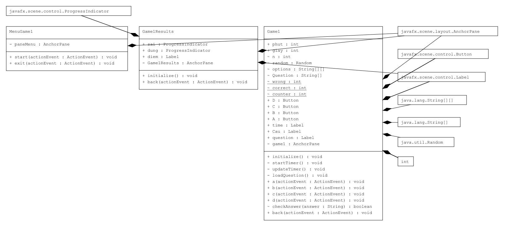

# Language Learning App

## Tác giả
  Nhóm "Trùm Suy":
  - Lương Thế Quyền (22021156) - K67CB
  - Đinh Thị Phương Thanh (22021167) - K67CB
  - Nguyễn Đình Trường (22021205) - K67CB

## Mô tả
1. App được thiết kế nhằm hỗ trợ người dùng trong việc học tiếng Anh.
2. App được viết bằng Java và sử dụng thư viện JavaFX.
3. Được tích hợp thêm các API hỗ trợ việc phát âm và phiên dịch một cách thuận tiện
4. Phần mềm có sử dụng database MySQL để lưu trữ, cùng với cấu trúc dữ liệu "Cây Trie" giúp việc quản lí và truy xuất dữ liệu nhanh chóng và chính xác.
5. Phần mềm bổ sung thêm 2 trò chơi là "Câu đố trắc nghiệm" và "Đoán từ" giúp người dùng có thể vừa học tiếng anh vừa có thể giải trí.

## Sơ đồ UML

## Cài đặt
1. Clone dự án từ https://github.com/rollingdowninthedeep/ProjectOOP_Dictionary.git
2. Mở dự án trong Intellij IDEA Community Edition.
3. Mở Project Structure (Crtl + Alt + Shift + S) -> Problem.
4. Với mỗi Problem chọn Fix -> Add to dependency.

## Hướng dẫn sử dụng
### Tìm kiếm
- Vào mục "Search" và nhập từ cần tìm vào thanh tìm kiếm và click vào một từ để xem nghĩa và phát âm của từ đó.
- Có thể chỉnh sửa hoặc xóa từ được chọn khỏi danh sách bằng cách click vào nút "Update" và "Delete".
- Muốn thêm 1 từ vào danh sách, hãy chọn "Add a word.." và nhập từ muốn thêm vào thanh tìm kiếm, nếu có từ xuất hiện trong danh sách nghĩa là từ đó đã có trong từ điển và có thể sử dụng tính năng chỉnh sửa cho từ đó, còn nếu không thì bạn có thể thêm nghĩa của từ vào bấm "Add" để lưu.
### Phiên dịch
- Điền văn bản cần dịch và bấm "Translate" để xem bản dịch.
- Có thể đổi từ Anh-Việt sang Việt-Anh.

## Demo

https://github.com/rollingdowninthedeep/ProjectOOP_Dictionary/assets/145013411/82cd9674-e028-40dd-b058-cfb1ee41826e

## Những cải tiến trong tương lai
1. Thêm nhiều ngôn ngữ.
2. Thêm các trò chơi phức tạp và thú vị hơn.
3. Tối ưu thuật toán quản lí dữ liệu để có thể lưu trữ được nhiều dữ liệu và truy cập nhanh hơn.
4. Tích hợp thêm tính năng ChatBot hỗ trợ người dùng trong việc học ngôn ngữ.
5. Cải thiện giao diện người dùng, giúp cho giao diện nhìn bắt mắt hơn.

## Đóng góp
Mã nguồn của dự án là mã nguồn mở, người dùng có thể clone và chỉnh sửa trực tiếp.

## Tình trạng của dự án : Hoàn thành

## Ghi chú
Ứng dụng này được viết cho mục đích giáo dục.

## Lời kết
  Chúng em xin cảm ơn thầy Nguyễn Đức Anh và thầy Kiểu Văn Tuyên, giảng viên của Trường Đại học Công nghệ - Đại học Quốc gia Hà Nội đã cung cấp kiến thức và hướng dẫn chúng em hoàn thành dự án này. 
